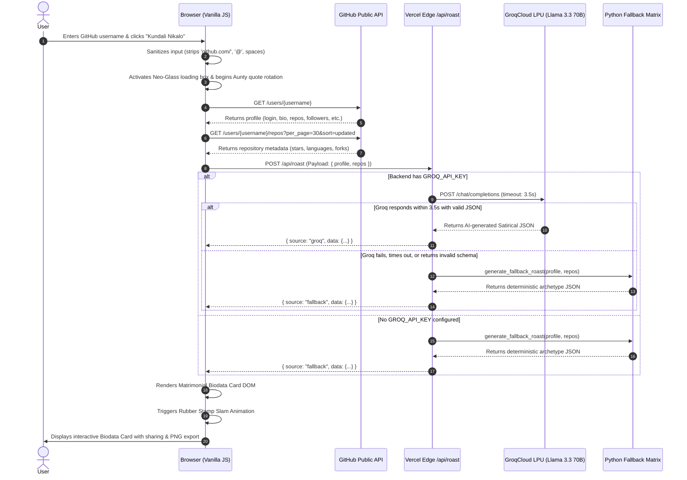

# 🏛️ Rishta Aunty — System Architecture & Technical Design

This document provides an exhaustive technical breakdown of the architecture, data flow, component interactions, serverless execution model, and resilience strategies powering **Rishta Aunty**.

---

## 1. High-Level Architectural Diagram

```
+----------------------------------------------------------------------------------------------------+
|                                         CLIENT BROWSER                                             |
|                                                                                                    |
|   +--------------------------------------------------------------------------------------------+   |
|   |                     Vanilla HTML5 / CSS3 / ES6+ JavaScript Frontend                        |   |
|   |    - Zero Frameworks (No React/Vue/Svelte)       - Neobrutalist + Glassmorphic UI Engine   |   |
|   |    - DOM Event Loop & Live Input Sanitizer       - Dynamic Rubber Stamp Animation Loop     |   |
|   |    - html2canvas Retinal Rasterizer (Scale: 2)   - Client-side Share Intent Generator      |   |
|   +--------------------------------------------------------------------------------------------+   |
|               |                                                       |                            |
|               | (1) Public Profile Ingestion                          | (3) POST /api/roast        |
|               v                                                       v                            |
+---------------+-------------------------------------------------------+----------------------------+
                |                                                       |
                |                                                       |
+---------------v------------------+                +-------------------v----------------------------+
|        GITHUB REST API           |                |             VERCEL SERVERLESS EDGE             |
|   api.github.com/users/{handle}  |                |       (@vercel/python WSGI Sandbox)            |
|   api.github.com/users/repos     |                +------------------------------------------------+
+----------------------------------+                |  - Entrypoint: api/index.py -> app.py          |
                                                    |  - Runtime: Python 3.9+ Serverless             |
                                                    |  - Environment: Production Linux Sandbox       |
                                                    +------------------------------------------------+
                                                                        |
                                                                        | (4) Dispatch Request
                                                                        v
                                                    +------------------------------------------------+
                                                    |            PYTHON ROAST CONTROLLER             |
                                                    |            (app.py & dual routing)             |
                                                    +------------------------------------------------+
                                                            |                                |
                                            [API Key Set?]  |                                |
                                                  YES       |                                | NO / On Timeout
                                                            v                                v
                                            +-------------------------------+   +--------------------+
                                            |     GROQCLOUD LPU ENGINE      |   |  DETERMINISTIC     |
                                            |  (llama-3.3-70b-versatile)    |   |  RULE ENGINE       |
                                            |  - 3.5s Circuit Breaker       |   |  (fallbacks.py)    |
                                            |  - Structured JSON Grammar    |   |  - <5ms Execution  |
                                            |  - Desi Satire Prompt Pipeline|   |  - Archetype Match |
                                            +-------------------------------+   +--------------------+
                                                            |                                |
                                                            +----------------+---------------+
                                                                             |
                                                                             v (5) Return JSON Payload
                                                            +--------------------------------+
                                                            |  Formatted Response Object:    |
                                                            |  { source, data: {...} }       |
                                                            +--------------------------------+
```

---

## 2. Component Breakdown

### 2.1. Client-Side Presentation Layer
- **Zero JavaScript Frameworks:** The client is implemented in pure, unadulterated ES6+ JavaScript (`app.js`), Vanilla CSS3 (`style.css`), and Semantic HTML5 (`index.html`).
- **No Bundlers / No Transpilation:** No Webpack, Vite, Rollup, Babel, or npm dependencies. Files are served as raw static assets directly from Vercel's global CDN edge nodes with sub-millisecond TTFB (Time to First Byte).
- **Direct GitHub API Ingestion:** The client queries the public GitHub REST API directly from the user's browser. This preserves server compute quotas, prevents backend IP throttling by GitHub, and leverages browser caching for repeated requests.
- **Retinal Image Synthesis (`html2canvas`):** When the user clicks "Download Biodata Card (PNG)", the client utilizes `html2canvas` with a custom `onclone` callback to instantiate a dedicated high-contrast export layer (`.card-frame.export-mode`), rasterizing the card at $2\times$ pixel ratio for mobile and retina displays.

### 2.2. Vercel Serverless Python Backend Layer
- **WSGI Serverless Shim (`api/index.py` & `api/roast.py`):**
  Vercel executes Python applications as serverless functions via the `@vercel/python` builder. Standard Flask applications require an entrypoint that exposes the WSGI `app` callable.
  `api/index.py` dynamically computes the absolute project root and injects it into `sys.path`:
  ```python
  import sys
  import os

  current_dir = os.path.dirname(os.path.abspath(__file__))
  parent_dir = os.path.dirname(current_dir)
  if parent_dir not in sys.path:
      sys.path.insert(0, parent_dir)

  from app import app
  ```
- **Vercel Routing (`vercel.json`):**
  All requests matching the `/api/(.*)` pattern are rewritten to the Python WSGI runtime:
  ```json
  {
    "version": 2,
    "rewrites": [
      {
        "source": "/api/(.*)",
        "destination": "/api/index.py"
      }
    ]
  }
  ```
  Static assets in the root (`index.html`, `style.css`, `app.js`, `fallbacks.js`) are served natively by Vercel without invoking serverless functions.

### 2.3. GroqCloud LPU (Language Processing Unit) AI Layer
- **Model:** `llama-3.3-70b-versatile` running on Groq's high-speed LPU inference engine.
- **Endpoint:** `https://api.groq.com/openai/v1/chat/completions`
- **Execution Latency:** Typically $300\text{ ms} - 1200\text{ ms}$ for complete generation.
- **Strict Structured JSON Enforcement:** The model is constrained via system prompts and schema enforcement to return pure JSON matching the matrimonial dossier specification. Markdown code fences (\`\`\`json) are stripped programmatically via regex sanitizers if present.
- **Fail-Safe Circuit Breaker:** The Python backend enforces a strict `timeout=3.5` seconds on the HTTP connection to GroqCloud. If the API key is missing, invalid, or the request exceeds 3.5 seconds, the request gracefully drops down to the Deterministic Fallback Matrix without throwing 500 errors.

### 2.4. Dual-Tier Fallback Matrix Layer
- **Python Backend Engine (`fallbacks.py`):** An analytical rule-based matrix inspecting 10+ signals (repo count, follower ratio, star count, dominant language, account age) to classify candidates into humorous developer archetypes (*"Senior Ghost Developer"*, *"CSS Button Designer"*, *"Linus Matrimonial King"*, *"TypeScript Over-Engineer"*, etc.).
- **Client-Side JS Engine (`fallbacks.js`):** A mirrored standalone engine bundled into the client bundle. If the backend serverless function is unreachable (e.g. network failure, AWS/Vercel outage), the client generates the exact same high-quality matrimonial biodata locally in $<10\text{ ms}$.

---

## 3. Detailed Data Flow & Execution Sequence



---

## 4. Resilience & Error-Handling Philosophy

1. **Zero Black Screens:** A core requirement is that no user ever encounters an empty screen, raw stack trace, or unhandled exception. Every network operation has a fallback.
2. **GitHub Rate-Limit Protection:**
   - The unauthenticated GitHub API limit is 60 requests per hour per IP.
   - Because calls originate directly from the user's browser, requests are distributed across client IPs rather than bottlenecking a single server IP.
   - If GitHub returns a 404 (Not Found), the UI renders a humorous Desi error (*"Aisa koi candidate GitHub pe register hi nahi hai beta!"*).
   - If GitHub returns a 403 (Rate Limited), the app offers an instant synthetic mock dossier so the demo continues without disruption.
3. **Structured Output Sanitization:**
   Large language models can occasionally append conversational text or wrap responses in markdown fences. `app.py` implements a robust multi-stage extraction pipeline:
   ```python
   raw_text = completion.choices[0].message.content.strip()
   
   # Strip markdown fences
   if raw_text.startswith("```"):
       lines = raw_text.split("\n")
       if lines[0].startswith("```"):
           lines = lines[1:]
       if lines and lines[-1].startswith("```"):
           lines = lines[:-1]
       raw_text = "\n".join(lines).strip()
       
   # Extract JSON object boundaries
   start_idx = raw_text.find("{")
   end_idx = raw_text.rfind("}")
   if start_idx != -1 and end_idx != -1:
       raw_text = raw_text[start_idx:end_idx + 1]
       
   parsed = json.loads(raw_text)
   ```

---

## 5. Security & Privacy Posture

- **Stateless Operation:** No candidate data, GitHub tokens, or roast results are stored in databases, logs, or persistent disks.
- **CORS Configured:** Permissive CORS headers (`Access-Control-Allow-Origin: *`) enable cross-domain embeddability if hosted across separate preview environments.
- **Environment Isolation:** Secrets like `GROQ_API_KEY` are stored strictly in serverless environment variables and never exposed to the client-side bundle.
- **Content Moderation:** System prompts strictly forbid derogatory jokes regarding religion, caste, sect, gender discrimination, or personal physical characteristics. All humor is 100% focused on developer habits, Git commits, open-source hoardings, and coding culture.
